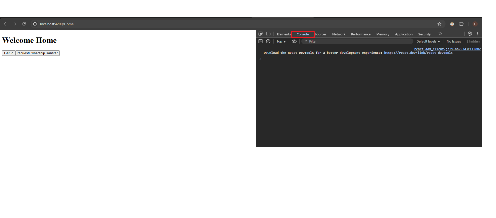

# Google Drive File Transfer Ownership

This project teach you how to transfer file Ownership using Google Drive Api and NodeJs

## Getting Started

To set up the project, follow these steps:

1. Clone the repository:

```bash
git clone https://github.com/fretzestavillo/file-transfer-ownership.git
```

2. Change Directory:

```bash
cd file-transfer-ownership/
```

3. Install the dependencies

```bash
npm install
```

4. Create a new project in Google Console  


5. Enable google drive api

  


6. Make an App

  


  


  


  

7. Publish your app

  


  


8. Create OAuth client Credentials 

  


  


9. Copy your Client ID and Authorized redirect URIs 
 
  


10. Create .env file in the root of your project then put these credentials

```bash

VITE_GOOGLE_CLIENT_ID='YOUR_GOOGLE_CLIENT_ID' 
VITE_REDIRECT_URI='YOUR_VITE_REDIRECT_URI'
VITE_NEW_EMAIL_OWNER='YOUR_NEW_EMAIL_OWNER'
VITE_FILE_ID='YOUR_FILE_ID' how to get? open the folder or file and look at the URL and find the id that looks like this : 1ay3A-8qWmmZfDbRGiLSGwG51-IbRA2jwF6cVlafIFnE
VITE_PERMISSION_ID='NEW_OWNERSHIP_PERMISSION_ID' how to get? run the application and click login then click the button Get Id in console log  

```


11. Get the VITE_FILE_ID. Go to your google drive then click the file that you want to transfer the ownership then get the file id on the URL


12. Check ENV File


13. Run the application and then go to http://localhost:4200

```bash

npm run serve:web

```


14. Get the permission id but make sure the file is already shared to the ownership as editor/writer





15. You can now transfer the ownership to the owner


16. Demo
[](https://youtu.be/p-F3BXq9nKE)
